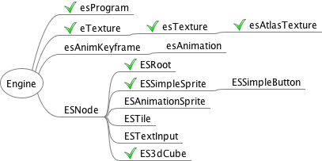
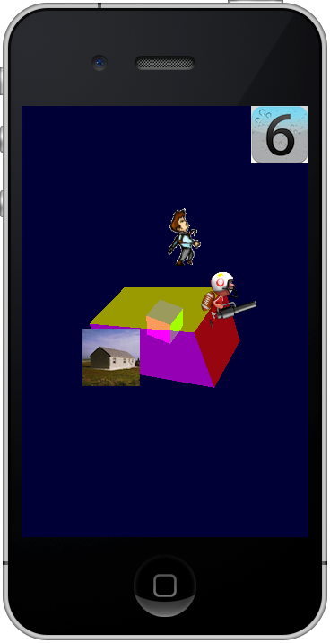
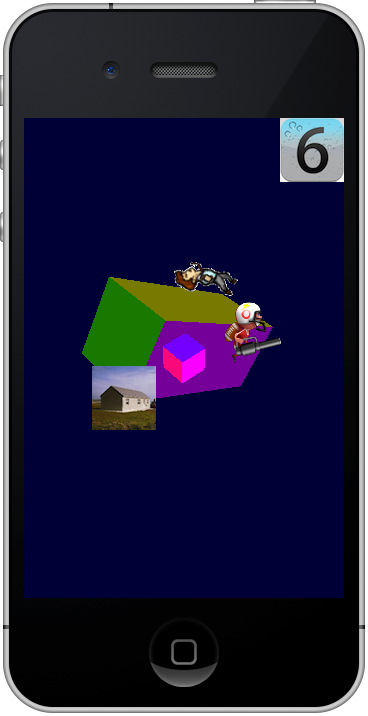
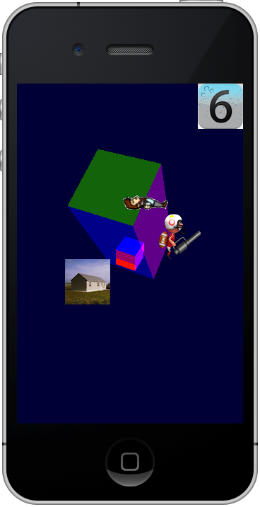

ESNode
======
My simple game engine based on OpenGLES2.0 and targeted iOS. 20130331  

----
#Plans  
  

----
#Snapshots
  
  
  

----
#credits  
The sprites of a man with red hair comes from [Open Game Art](http://opengameart.org/content/2d-hero).  
The sprites of a football player with a gun comes from our previous game.  
All sprite-sheets are made by [TexturePacker](http://www.codeandweb.com/texturepacker).

